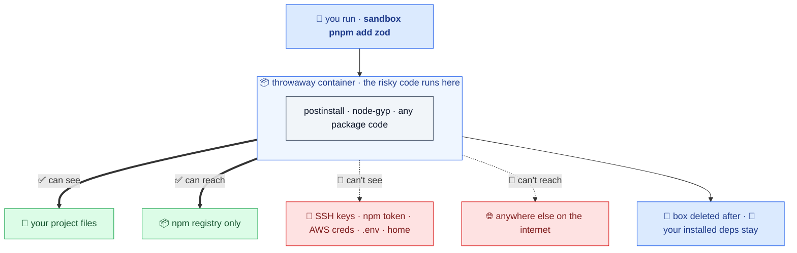

## The threat: `npm install` runs code you never read

A dependency's `postinstall`, `preinstall`, or `node-gyp` step runs arbitrary code on your machine, with your shell's full access: your SSH keys, your npm token, your cloud credentials, your `.env`, your home directory, and the open internet. You didn't read that code, and you can't, for every transitive dependency. That's the supply-chain attack surface sandbox closes.

## The everyday defense: vet, then install natively

The default path catches a bad dependency *before* it lands, then installs mode-aware. A fresh or host-native project installs natively on the host so your IDE and tools get host-native binaries. A container-built tree stays contained. `sandbox add zod` runs the [supply-chain gates](#supply-chain-gates-before-the-bytes-arrive) against the exact versions it would fetch, then, if they pass, runs the real package manager in the right mode for that project. The gate engine is the everyday product. The container is the real boundary when trust drops. `sandbox add` auto-detects your package manager, and the explicit `sandbox <pm>` form is the contained twin for the same operation.

## The boundary, when you opt in

Explicit `sandbox pnpm add zod` (or a [devcontainer](/agent-isolation/)) runs the whole install inside a throwaway container, the real boundary for untrusted code, AI agents, and CI:



The container can see your project and reach the registry. It cannot see your credentials or reach the rest of the internet. When the command finishes, sandbox deletes the box; your installed `node_modules` stays.

## What enforces the boundary

Four controls, on for every contained install:

- **No credentials.** Your home directory and credential files are never mounted. The container starts with nothing of yours except the project.
- **Default-deny egress.** The container reaches only the registry hosts on your allowlist. A proxy blocks everything else and tells you what it stopped.
- **Read-only persistence.** `.git`, `.github`, `.husky`, `.claude`, `.vscode`, and `package.json` are mounted read-only, so an install can't plant a hook that runs later.
- **Dropped capabilities.** `--cap-drop ALL`, `--security-opt no-new-privileges`, and a container-root that is not your host root.

## Supply-chain gates, before the bytes arrive

This is the always-on layer, on every install path, and `sandbox check` / `preflight` run it standalone with no Docker at all. Anything that pulls a *new* version (`install`, `add`, `update`, `dedupe`, `upgrade`) passes the gates first:

- **Known malware.** OSV advisories plus your own malware feeds and team advisories. A match is a hard block.
- **Release-age cooldown.** Blocks versions published in the last N days when you set one, the window where publish-and-detonate worms live. Safe-install can substitute an aged release and pin it.
- **Typosquats & risk hints.** Name-confusion, provenance regressions, maintainer changes, expired domains, suspiciously-low downloads, and freshly-published versions.
- **Deprecation.** Abandoned versions are blocked by default.

Removing a dependency fetches nothing new, so it skips the gates.

## It mirrors your package manager

You don't learn a new vocabulary. sandbox auto-detects npm, pnpm, yarn, or bun from your lockfile and `packageManager` field, and runs the command you typed. `sandbox add zod` stays pnpm in a pnpm project; `sandbox install --frozen` stays a frozen install. Prefer your package manager's own keystrokes? The per-PM shortcuts (`sandbox-pnpm add zod`, `spnpm add zod`, `snpm ci`) take the same gated, mode-aware path with fewer keystrokes. Your real `pnpm` is never shadowed, you opt in by typing `sandbox` or the prefix.

:::note[One mode per project]
`node_modules` is either LOCAL (host-native, from your own package manager or the native-default sandbox path, so the IDE just works) or CONTAINER (the Linux tree an explicit contained install builds). Never both. sandbox tells them apart by the native binaries in the tree (read live, so it can't go stale), and before a contained install would replace a host-native tree with a Linux one the IDE can't load it warns, and on a terminal asks you to confirm the switch. Want containment and a happy IDE together? A [devcontainer](/agent-isolation/) keeps `node_modules` in a Docker volume with the editor and deps in the box.
:::

## Turn it off for a repo you trust

`sandbox` is a transparent passthrough when containment is off:

```bash
sandbox off        # writes off:true to a git-ignored local override
sandbox on         # back in the box
SANDBOX_OFF=1 sandbox install       # one command
```

Sandbox-only commands (`check`, `doctor`, `verify`, …) keep working either way.
